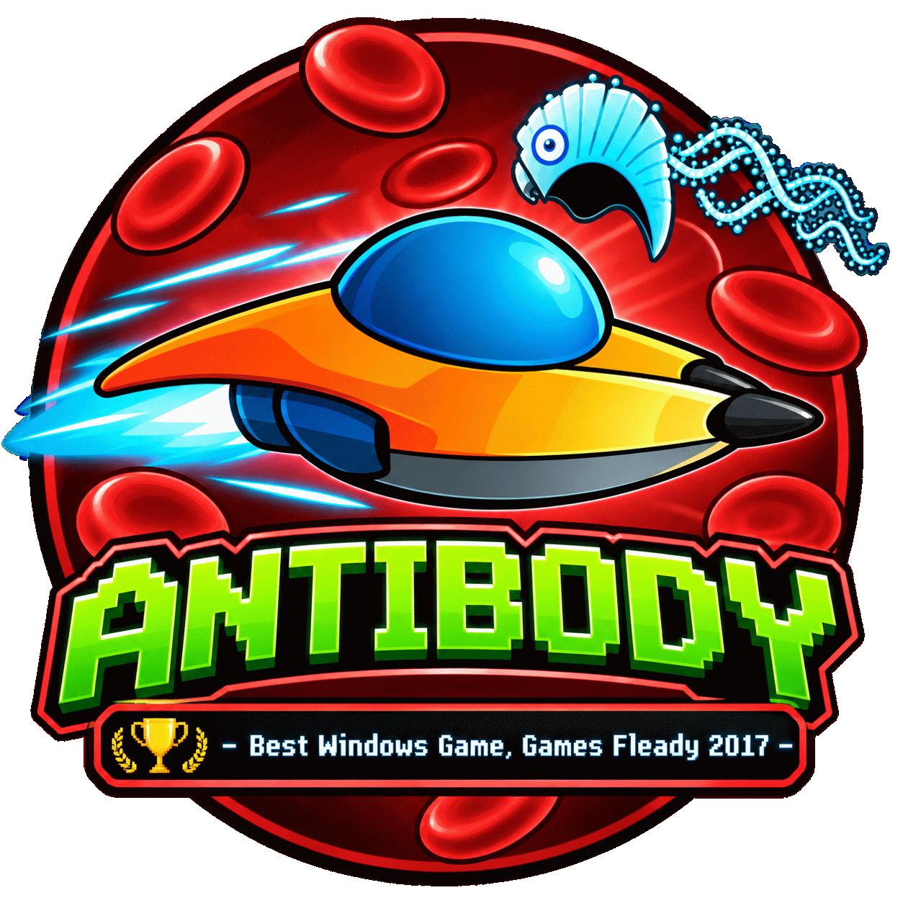
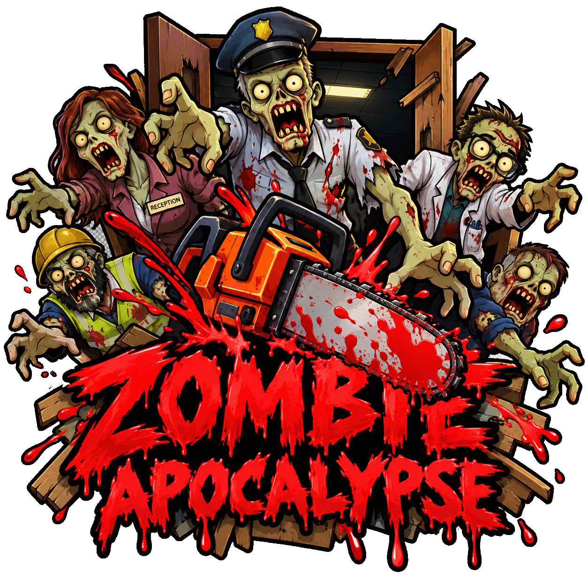
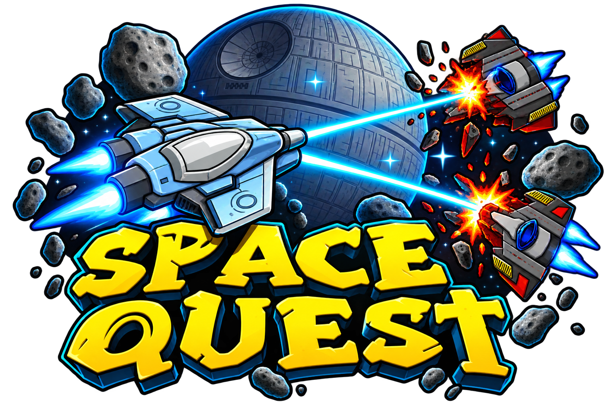

 
 <!-- Link to DKIT Project -->
 
 
 

## Hi there 👋

Some playable games from tutorials and college courses I've worked on in college, etc.:

  
  
  

## GitHub Pages

JavaScript:
- [Antibody](https://github.com/JoeORegan/JS-Antibody): JavaScript browser game project.
- [Flappy Bird](https://github.com/JoeORegan/JS-FlappyBird): JavaScript Flappy Bird clone.
- [Space Quest](https://github.com/JoeORegan/JS-SpaceQuest): JavaScript space-themed game project.
- [Space Game](https://github.com/JoeORegan/JS-SpaceGame): JavaScript space game tutorial project.
- [Ninja Game](https://github.com/JoeORegan/JS-NinjaGame): JavaScript side-scrolling ninja game.
- [Connect 5](https://github.com/JoeORegan/NodeJS-AppsAndTutorials): Connect 5 app from Node.js tutorials collection.
- [Tic-Tac-Toe](https://github.com/JoeORegan/NodeJS-AppsAndTutorials): JavaScript Tic-Tac-Toe app from Node.js tutorials collection.
- [Tic-Tac-Toe (React)](https://github.com/JoeORegan/React-TicTacToe): React Tic-Tac-Toe tutorial app.
- [Space Invaders](https://github.com/JoeORegan/JS-SpaceInvaders): JavaScript Space Invaders clone.

App Inventor (HTML 5 Ports)
- Tower Defence
  - [App on GithHub Pages](https://joeaoregan.github.io/LIT-Yr2-HCID/tower-defence/)

Construct 2:
- Hospital Panic
    - [App on GitHub Pages](https://joeaoregan.github.io/LIT-Yr2-DigitalGameDesign/)
 
SDL 2.0:
- [Alien Attack](https://github.com/joeaoregan/LIT-Yr3-AdvancedDigitalGameProgramming)
    - [Play on GitHub Pages](https://joeaoregan.github.io/LIT-Yr3-AdvancedDigitalGameProgramming/play/)

Unity 2D:
- [UFO](https://joeoregan.github.io/unity-games/Unity/2d-ufo.html)
- [Roguelike](https://joeoregan.github.io/unity-games/Unity/2d-roguelike.html)

Unity 3D (Modified):
- [Roll-A-Ball (Modified)](https://joeoregan.github.io/Unity-RollABall/)
- [Space Shooter (Extended)](https://joeoregan.github.io/Unity-SpaceShooter/)

Unity 3D (Original):
- Zombie Apocalypse
  - [Level 1](https://joeoregan.itch.io/za1)
  - [Level 2](https://joeoregan.itch.io/za2)
- [Roll-A-Ball (Original)](https://joeoregan.github.io/unity-games/Unity/roll-a-ball.html)
- [Space Shooter (Original)](https://joeoregan.github.io/unity-games/Unity/space-shooter.html)
- [Tanks](https://joeoregan.github.io/unity-games/Unity/tanks-original.html)
- [Nightmares](https://joeoregan.github.io/unity-games/Unity/nightmares.html)
- [Roll-A-Ball v2](https://joeoregan.github.io/unity-games/Unity/roll-a-ball-v2.html)

## Render (A bit slower to load): 

- [Angular Tetris](https://tetris-js.onrender.com/)
- [Space Quest](https://spacequest.onrender.com/)

<!--

**Here are some ideas to get you started:**

🙋‍♀️ A short introduction - what is your organization all about?
🌈 Contribution guidelines - how can the community get involved?
👩‍💻 Useful resources - where can the community find your docs? Is there anything else the community should know?
🍿 Fun facts - what does your team eat for breakfast?
🧙 Remember, you can do mighty things with the power of [Markdown](https://docs.github.com/github/writing-on-github/getting-started-with-writing-and-formatting-on-github/basic-writing-and-formatting-syntax)
-->
